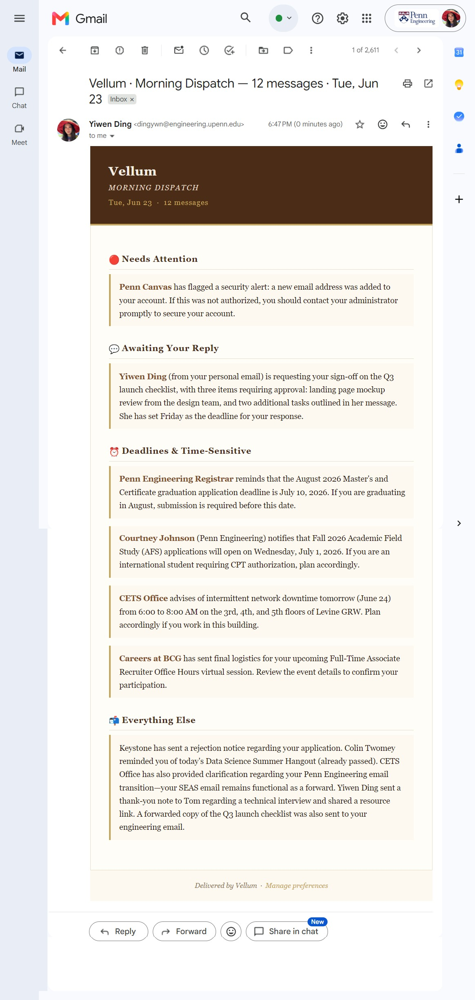

# Vellum

An AI inbox digest service. Connects to your mailboxes via Nylas, watches for incoming email via webhook, and periodically delivers an AI-written summary so you can skip the firehose.

Multi-tenant by design: one user can connect multiple mailboxes. Bring your own LLM key — Anthropic, Gemini, or OpenAI.

**Demo (prototype):** https://youtu.be/iU5g4-ytwSI

> *The clip above shows an earlier prototype. The current interface uses Vellum's parchment-style design:*



*Early prototype walkthrough:*


---

## Architecture

A single Express + TypeScript server with SQLite for persistence and node-cron for scheduling. No separate services or queues required — the DB is the source of truth for everything durable.

```
Browser → GET /           → Web UI (connect mailboxes + configure digest)
Browser → /auth/connect   → Nylas hosted OAuth → /auth/callback → user + grant stored in SQLite
Nylas   → POST /webhooks/nylas → HMAC verified → messageId enqueued → async processor fetches + stores
node-cron (every 1 min)   → claimDue() → InboxReader (all grants) → LLM Summarizer → EmailSender → digest sent
```

Sessions are cookie-based (30-day TTL, stored in SQLite). A user may connect multiple mailboxes; all are aggregated into a single digest.

---

## Prerequisites

- Node.js 20+
- A [Nylas](https://nylas.com) account (free tier is enough)
- An API key from one of: [Anthropic](https://console.anthropic.com), [Google AI Studio](https://aistudio.google.com), or [OpenAI](https://platform.openai.com)
- A server with a public HTTPS URL (for webhook delivery and OAuth callbacks)

---

## Nylas App Setup (from scratch)

1. Sign up at [dashboard.nylas.com](https://dashboard.nylas.com)
2. Create a new application
3. Note your **API Key** and **Client ID** from the app settings
4. Under **OAuth → Callback URIs**, add your public callback URL (e.g. `https://vellum-mail.up.railway.app/auth/callback`)
5. Under **Connectors**, enable the email providers you want to support (Google, Microsoft, etc.)
6. Under **Webhooks**, add a webhook pointing at `https://vellum-mail.up.railway.app/webhooks/nylas` with trigger `message.created` — copy the **signing secret** shown after creation

---

## Installation

```bash
git clone https://github.com/dingonewen/vellum.git
cd vellum
npm install
cp .env.example .env
# fill in .env with your keys
```

> **Note (Ubuntu / Node 20+):** `better-sqlite3` is a native module. If `npm install` fails with an ABI mismatch error, rebuild it from source:
> ```bash
> sudo apt-get install -y build-essential python3
> npm install better-sqlite3 --build-from-source
> ```

### Environment Variables

| Variable | Description |
|----------|-------------|
| `NYLAS_API_KEY` | Nylas API key (also used as client secret for OAuth code exchange) |
| `NYLAS_CLIENT_ID` | Nylas OAuth client ID |
| `NYLAS_WEBHOOK_SECRET` | Signing secret from Nylas webhook settings (optional at startup, required for webhook delivery) |
| `NYLAS_API_URI` | Nylas API base URL (default: `https://api.us.nylas.com`) |
| `APP_BASE_URL` | Public base URL of this server (e.g. `https://vellum-mail.up.railway.app`) |
| `CALLBACK_URL` | Full OAuth callback URL — must match what's registered in Nylas Dashboard |
| `PORT` | HTTP port (default: `3000`) |
| `DATABASE_PATH` | SQLite database file path (default: `./data/vellum.db`) |

No server-side LLM key is required. Each user supplies their own API key through the web UI.

---

## Running

### Development (local)

```bash
npm run dev
```

For local OAuth to work, add `http://localhost:3000/auth/callback` to your Nylas Dashboard callback URIs.

### Production

```bash
npm run build
pm2 start dist/server.js --name vellum
pm2 save
pm2 startup  # auto-start on reboot
```

---

## Exposing the Webhook (HTTPS)

Nylas requires HTTPS for OAuth callbacks and webhook endpoints. On a Linux VM, use **Caddy + sslip.io**:

- `sslip.io` is a free wildcard DNS service — `40-160-15-19.sslip.io` resolves to `40.160.15.19`
- Caddy automatically obtains a Let's Encrypt certificate
- No domain purchase or manual certificate management required

```bash
sudo apt-get install -y debian-keyring debian-archive-keyring apt-transport-https curl
curl -1sLf 'https://dl.cloudsmith.io/public/caddy/stable/gpg.key' | sudo gpg --dearmor -o /usr/share/keyrings/caddy-stable-archive-keyring.gpg
curl -1sLf 'https://dl.cloudsmith.io/public/caddy/stable/debian.deb.txt' | sudo tee /etc/apt/sources.list.d/caddy-stable.list
sudo apt update && sudo apt install -y caddy

sudo tee /etc/caddy/Caddyfile > /dev/null <<'EOF'
YOUR-IP-WITH-DASHES.sslip.io {
    reverse_proxy localhost:3000
}
EOF

sudo systemctl restart caddy
```

Set `APP_BASE_URL` and `CALLBACK_URL` in `.env` to match the sslip.io hostname.

---

## End-to-End Flow

### 1. Connect a mailbox

Open `https://vellum-mail.up.railway.app` in a browser. Click **Connect a mailbox** — this redirects to Nylas hosted OAuth. After authorizing, you're returned to the setup page with the connected email shown.

Connect as many mailboxes as you like. All will be aggregated into a single digest.

Unhappy paths handled:
- User denies consent → returned with an error message
- State nonce expired or missing → rejected with 400
- Code exchange fails → 502 with message

### 2. Configure your digest

Fill in:
- **Deliver digest to** — the email address to receive digests
- **Frequency** — a preset cadence (every minute / hourly / daily 8am / weekly Monday)
- **AI provider** — Anthropic (Claude Haiku), Google (Gemini 2.0 Flash), or OpenAI (GPT-4o mini)
- **API key** — your personal key for the chosen provider

Click **Save & Schedule**. The confirmation shows which mailboxes are being watched and when the first dispatch arrives.

### 3. Incoming mail is collected via webhook

When a new email arrives, Nylas POSTs to `/webhooks/nylas`. The handler:
1. Verifies the `x-nylas-signature` HMAC with `timingSafeEqual`
2. Returns 200 immediately
3. Enqueues the `messageId` into `pending_messages`

A background processor polls every 5 seconds, claims a batch atomically, refetches each full message from Nylas (never trusts truncated webhook payloads), and upserts it into the `messages` table (`INSERT OR IGNORE` for deduplication).

### 4. Scheduled digest is sent

node-cron fires every minute and calls `claimDue()` — an atomic SQLite transaction that finds a due schedule and claims it. The job runner:
1. Fetches messages since `last_summary_at` from **all connected mailboxes** (paginated, max 200 total)
2. Merges and sorts them by arrival time
3. Passes them to the user's chosen LLM summarizer
4. Sends the styled HTML digest via Nylas to the destination address
5. Updates `last_summary_at` and computes the next fire time

If there are no new messages, the digest is skipped — no empty emails sent.

---

## Design Decisions & Tradeoffs

### Multi-tenant with session-based auth

Each visitor who completes OAuth becomes a `user` (UUID, stored in SQLite). A session cookie (30-day TTL) ties subsequent visits to that user. Connecting another mailbox from the same browser session adds a second `grant` to the same user — all grants are aggregated at digest time.

The `schedules` table is keyed on `user_id` (one schedule per user, not per mailbox), so cadence configuration is unified regardless of how many mailboxes are connected.

### Scheduling: DB-backed atomic claim

**Mechanism:** `node-cron` polls every minute. All schedule state (`next_fire_at`, `last_summary_at`, `claimed_at`) lives in SQLite.

| Requirement | How |
|-------------|-----|
| Survives restart | `next_fire_at` is persisted in SQLite, not RAM |
| Per-user | One row per `user_id` in `schedules` table |
| Fires once | `UPDATE schedules SET claimed_at = ? WHERE claimed_at IS NULL AND next_fire_at <= ?` — only the process that wins proceeds |

**Tradeoff:** SQLite's single-writer model means this scales to one process. For multi-instance deployments, PostgreSQL with `SELECT FOR UPDATE SKIP LOCKED` is the upgrade path.

### Webhook deduplication

Two layers:
1. **Pending queue** — `pending_messages` table; duplicates are wasteful but harmless
2. **Messages table** — `INSERT OR IGNORE INTO messages ... UNIQUE(message_id)`; the authoritative dedup

Truncated payloads are handled by always refetching the full message from Nylas — webhook content is never trusted.

### AI summarizer seam

`assemblePrompt(messages)` and `parseResponse(text, count)` are pure functions with no I/O. They are shared across all three provider implementations. The `Summarizer` interface (`{ summarize(messages): Promise<SummaryResult> }`) is the only boundary the orchestrator depends on — stub it with a fixture for testing without any API key.

Provider selection happens at job-run time based on the user's stored `llm_provider` field. All model names are centralized in `src/summarizer/models.ts` — one file to update if a model is deprecated.

### External dependency interfaces

All external calls (Nylas API, LLM APIs) are behind TypeScript interfaces (`NylasClient`, `Summarizer`, `EmailSender`, `InboxReader`). A live mailbox or API key is not required to test orchestration logic.

---

## Assumptions

- **First run lookback:** When no previous summary exists, the job fetches the last 24 hours of inbox.
- **Max messages per summary:** Capped at 200 across all mailboxes to keep prompt size and latency bounded.
- **OAuth state:** CSRF nonces are stored in an in-memory Map with a 10-minute TTL. They do not survive a process restart (acceptable — the user just re-clicks connect).
- **Cadence as cron expression:** A standard 5-field cron expression. `cron-parser` computes `nextFireAt` from it.
- **Primary sender:** When a user has multiple mailboxes, the digest is sent from the first connected mailbox (ordered by `created_at`).

---

## What I'd Do With More Time

- **Unit tests** for `assemblePrompt`, `parseResponse`, `ScheduleStore.claimDue`, and `MessageStore.upsertMessage` using `initDb(":memory:")` fixtures
- **Webhook retry handling** — exponential backoff with a retry counter instead of the current stale-claim TTL release
- **Batch schedule claiming** — `claimDue()` claims one schedule per minute tick; a batch claim would be more efficient with many users
- **OAuth state persistence** — store nonces in SQLite rather than an in-memory Map so they survive restarts
- **Rate limiting** on the webhook endpoint to mitigate replay attacks beyond HMAC verification
- **Encrypted key storage** — LLM API keys are currently stored in plaintext in SQLite; envelope encryption would be the right upgrade for a production deployment
- **Railway / cloud deployment guide** — persistent volume setup for SQLite, environment variable configuration
